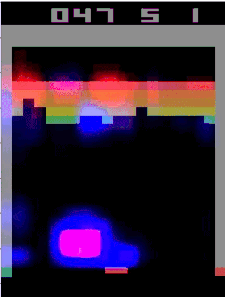
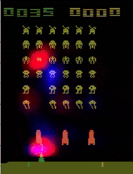

Visualizing and Understanding Atari Agents
=======
[Link to paper](https://goo.gl/AMAoSc)

Sam Greydanus. October 2017. MIT License. [Explainable AI Project](http://twitter.com/DARPA/status/872547502616182785). Supported by DARPA.

Strong agents
--------

The Breakout agent executes a tunneling strategy. The Pong agent makes a kill shot. The SpaceInvaders agent displays an aiming strategy. (All agents are LSTM-CNN trained via A3C; Blue=actor, Red=critic)

Overfit agents
--------
 * WITHOUT saliency:
 	* overfit agent: https://youtu.be/TgTpF-EXPwc
 	* control agent: https://youtu.be/i3Br2PzE49I
 * WITH saliency:
 	* overfit agent: https://youtu.be/eeXLUI73RTo
 	* control agent: https://youtu.be/xXGC6CQW97E

Learning
--------

The Breakout agent learns a tunneling stategy (each frame is separated by ~1e7 frames of training).

About
--------
A quick comparison of our method to Jacobian-based saliency: [Jupyter notebook](https://nbviewer.jupyter.org/github/greydanus/visualize_atari/blob/master/jacobian-vs-perturbation.ipynb)

**Abstract.** Deep reinforcement learning (deep RL) agents have achieved remarkable success in a broad range of game-playing and continuous control tasks. While these agents are effective at maximizing rewards, it is often unclear what strategies they use to do so. In this paper, we take a step toward explaining deep RL agents through a case study in three Atari 2600 environments. In particular, we focus on understanding agents in terms of their visual attentional patterns during decision making. To this end, we introduce a method for generating rich saliency maps and use it to explain 1) what strong agents attend to 2) whether agents are making decisions for the right or wrong reasons, and 3) how agents evolve during the learning phase. We also test our method on non-expert human subjects and find that it improves their ability to reason about these agents. Our techniques are general and, though we focus on Atari, our long-term objective is to produce tools that explain any deep RL policy.

Pretrained models
--------
We provide pretrained models for obtaining results like those in the "Strong agents" and "Overfit agents" sections of the paper. These models were obtained using [this repo](https://github.com/greydanus/baby-a3c) (default hyperparameters).
 1. Download from [https://goo.gl/fqwJDB](https://goo.gl/fqwJDB)
 2. Unzip the file in this directory

Dependencies
--------
All code is written in Python 3.6. You will need:
 * NumPy
 * SciPy
 * Matplotlib
 * [PyTorch 0.2](http://pytorch.org/): easier to write and debug than TensorFlow :)
 * [Jupyter](https://jupyter.org/)
